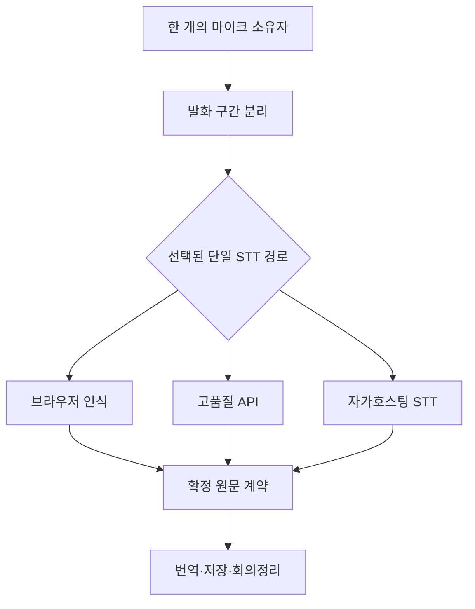

# VoiceFlow 스마트폰 Chrome PWA 음성 품질 복구 종합계획

- 기준 운영 SHA: `5d1a1f21a602b20322a5215698b5b06e51de210b`
- 작성일: 2026-09-01
- 최우선 목표: 사용자가 말한 내용과 원문이 달라지는 문제를 먼저 해결한다.
- 제품 기준: PC 메인화면의 정보 구조와 기능을 기준으로 삼고, 스마트폰에서는 반응형 배치만 바꾼다.
- 변경 원칙: 기존 PC·운영 루트는 동결하고 새 음성 경로는 별도 플래그와 시험 URL에서만 검증한다.

## 1. 현재 판정

| 항목 | 판정 | 근거 |
|---|---|---|
| PC 기준 화면 보호 | PASS | 새 실험은 `/v4/local-stt-test/`에 격리되어 있음 |
| 가입·기존 계정 로그인 | CONDITIONAL | 자동 Chromium 검사는 통과했으나 실기기 회귀 이력이 있음 |
| 모바일 스크롤·확대 | CONDITIONAL | 자동 viewport 검사는 통과했으나 실기기 체감 실패가 반복됨 |
| 약 600MB Whisper Small 다운로드 | DEVICE FAIL | 다운로드 오류 수정 뒤에도 실행·품질·복잡성 문제가 남음 |
| 마이크 연결→음성 원문 | DEVICE FAIL | 모델 준비와 마이크 연결 후 원문이 나타나지 않는 실기기 증거가 있음 |
| 발화 내용 일치 | BLOCKER FAIL | 사용자가 말한 내용과 다른 원문이 생성됨 |
| 회의 저장·번역·정리 | CONDITIONAL | 텍스트 입력 경로는 유지되지만 잘못된 원문이 들어가면 파생 결과도 잘못됨 |
| 운영 자동검사 | PASS | CI·Docker·브라우저 계약은 통과했지만 실제 Samsung 성공을 대체하지 못함 |

결론: 현재 다운로드 모델을 더 키우거나 UI에 옵션을 추가하지 않는다. 음성 품질을 동일 음원으로 비교할 수 있는 계측·Provider 계약부터 다시 만든다.

## 2. 제품 목표

### 사용자에게 보이는 최종 화면

- PC 메인화면과 동일한 메뉴·기능·데이터를 사용한다.
- 음성 조작은 `말하기 시작`과 `말하기 완료`만 기본 노출한다.
- 음성 방식과 Provider는 일반 화면에 나열하지 않는다.
- 고급 설정에서만 `자동`, `고품질`, `절약`, `텍스트 전용`을 선택한다.
- 기기나 권한이 부족하면 이유를 한 줄로 표시하고 텍스트 입력을 유지한다.
- 원문을 먼저 확정한 뒤 번역과 회의정리를 파생한다.

### 성공 조건

1. 무음·잡음에서 원문 생성 0건.
2. 한국어 실사용 샘플 평균 CER 12% 이하.
3. 숫자·날짜·금액 보존 100%.
4. 지정 고유명사 보존 95% 이상.
5. 최종 원문 p95 지연 2.5초 이하.
6. 원문 누락·중복·순서 뒤바뀜 0건.
7. PC 핵심 기능과 모바일 텍스트 입력 회귀 0건.
8. Samsung 최종 1회 시험에서 말한 문장과 표시 원문이 일치.

## 3. 목표 구조

핵심 규칙:

- 한 세션에서 마이크와 STT 소유자는 하나만 활성화한다.
- 브라우저 인식과 API 인식을 동시에 실행하지 않는다.
- Provider 전환은 현재 발화를 종료한 뒤에만 허용한다.
- STT 요청에는 번역 대상 언어를 보내지 않는다.
- STT 결과는 답변·요약·문장 재작성 없이 원문 그대로 저장 후보가 된다.
- `session_id + utterance_id + sequence`가 맞지 않는 늦은 결과는 폐기한다.
- interim 결과는 화면 미리보기일 뿐 저장하지 않는다.
- final 결과만 번역·저장·회의정리로 전달한다.

## 4. 입력 경로

| 경로 | 마이크 소유 | 장점 | 제약 | 기본 정책 |
|---|---|---|---|---|
| Chrome 브라우저 인식 | 브라우저 인식 세션 | 빠름, 별도 서버 STT 비용 없음 | 기기·언어팩·브라우저 편차 큼 | 빠른 경로 후보 |
| 고품질 STT API | PWA 오디오 캡처 | Android/iPhone 품질 일관성, 스트리밍 가능 | 음성 전송 동의·사용량 비용 필요 | 품질 우선 권장 후보 |
| 자가호스팅 faster-whisper | PWA 오디오 캡처 | Provider 종속 감소, 데이터 통제 | GPU 필요, 운영비·지연 관리 필요 | GPU 확보 후 후보 |
| 다운로드 모델 | PWA 오디오 캡처 | 음성 서버 전송 없음 | 대용량·발열·배터리·iPhone 제약 | 일반 화면에서 제외, 연구실만 유지 |
| 텍스트 전용 | 없음 | 모든 기기에서 안전 | 음성 편의 없음 | 항상 유지하는 최종 안전 경로 |

현재의 600MB Whisper Small은 `기본 추천`에서 제거한다. 기존 후보 파일은 비교 증거로 보존하되 운영 메인화면에는 연결하지 않는다.

## 5. 공개소스 적용

| 구성 | 후보 | 용도 | 도입 조건 |
|---|---|---|---|
| 발화 감지 | Silero VAD | 무음·잡음 업로드와 환각 차단 | Android/iPhone 실제 브라우저 검증 통과 |
| 브라우저 VAD 래퍼 | `@ricky0123/vad-web` | 음성 구간 콜백과 ONNX 실행 | iPhone 호환성 검증 전 기본 사용 금지 |
| 자가호스팅 STT | faster-whisper | GPU 서버의 고품질 Whisper 실행 | GPU 벤치마크와 운영비 승인 |
| 경량 로컬 연구 | whisper.cpp | 브라우저/WASM 비교 | 실기기 속도·품질이 API보다 나을 때만 |

공식 근거:

- Silero VAD: https://github.com/snakers4/silero-vad
- 브라우저 VAD: https://github.com/ricky0123/vad
- faster-whisper: https://github.com/SYSTRAN/faster-whisper
- whisper.cpp: https://github.com/ggml-org/whisper.cpp

1차 구현은 라이선스가 허용되는 순수 계약·평가 코드부터 시작한다. 오픈소스 런타임을 번들에 넣기 전 버전·라이선스·iPhone 실기기 호환성을 별도 승인한다.

## 6. STT API 후보

| 우선순위 | Provider | 후보 모델/기능 | 한국어·베트남어 | 역할 |
|---|---|---|---|---|
| A | Google Cloud STT | Chirp 3 streaming | `ko-KR`, `vi-VN` GA | 품질 기준 후보 |
| A | Deepgram | Nova-3 streaming | `ko-KR`, `vi` 지원 | 속도 기준 후보 |
| B | OpenAI | `gpt-live-transcribe` 또는 `gpt-transcribe` | 실제 음원 A/B 필요 | 문맥·키워드 후보 |
| B | Azure Speech | 실시간 STT | `ko-KR` 지원, 베트남어 별도 확인 | 기업 계정 대안 |
| C | faster-whisper | large-v3 계열 | 다국어 | GPU 자가호스팅 대안 |

공식 근거:

- Google Chirp 3: https://cloud.google.com/speech-to-text/docs/models/chirp-3
- Deepgram 모델·언어: https://developers.deepgram.com/docs/models-languages-overview
- OpenAI 파일 STT: https://developers.openai.com/api/docs/guides/speech-to-text
- OpenAI 실시간 STT: https://developers.openai.com/api/docs/guides/realtime-transcription
- Azure 언어 지원: https://learn.microsoft.com/azure/ai-services/speech-service/language-support

Provider 선택은 광고 문구가 아니라 같은 Samsung 녹음 파일의 측정값으로 결정한다. API 키·결제·Provider 기본값은 사용자 승인 전 변경하지 않는다.

## 7. 번역과 회의정리

### 번역

- 1순위: 현재 운영 검증 이력이 있는 DeepL.
- 2순위: Google Translate API.
- 3순위: Claude/OpenAI/Gemini 텍스트 파이프라인은 번역 QA 또는 명시적 대체 경로.
- 숫자·금액·날짜·부정 표현·제품명은 번역 전후 자동 대조한다.

### 회의정리

- 확정된 원문만 입력으로 사용한다.
- 번역문은 화면 표시용 파생값이며 원문을 덮어쓰지 않는다.
- 잘못된 STT를 LLM이 자연스럽게 고쳐 쓴 결과를 원문으로 저장하지 않는다.
- 회의정리 실패가 음성 입력이나 원문 저장을 되돌리지 않게 한다.
- `original_text`, `source_language`, `provider`, `model`, `utterance_id`, `created_at`을 유지한다.

이 구조에서는 STT Provider를 바꿔도 기존 caption·번역·회의정리 기능은 그대로 사용할 수 있다.

## 8. 동일 음원 품질 시험

### 시험 방식

1. 시험 모드에서 Samsung이 음성을 한 번만 녹음한다.
2. 오디오는 시험 세션 메모리에만 유지하고 자동 저장하지 않는다.
3. 같은 파일을 선택된 Provider에 순차 전송한다.
4. 각 Provider의 원문·지연·오류·비용 추정치를 같은 표에 표시한다.
5. 기준 원문과 비교해 CER, 숫자, 고유명사, 누락, 환각을 계산한다.
6. 합격한 Provider만 운영 자동 라우터 후보가 된다.

### 필수 시험 세트

- 한국어 일상 회의 문장.
- 한국어 숫자·시간·금액·날짜.
- 한국인 발음의 베트남어 이름·회사명.
- 베트남어 발화와 한국어 번역.
- 조용한 환경, 사무실 소음, 5초 무음.
- 짧은 문장, 연속 두 문장, 화면 잠깐 전환 후 복귀.

### 결과 상태

- `PASS`: 모든 BLOCKER 기준 충족.
- `CONDITIONAL`: 자동검사는 통과했지만 실기기 또는 비용이 미확인.
- `FAIL`: 내용 불일치·환각·누락·중복·권한 반복 중 하나라도 발생.
- `UNVERIFIED`: 실행하지 않은 항목.

## 9. UI 적용 순서

1. 현재 운영 PC 화면과 메뉴·기능 목록을 동결 기준으로 기록한다.
2. 스마트폰에서 같은 구성요소를 세로 배치하고 문서 전체 스크롤을 허용한다.
3. viewport는 사용자 확대·축소를 허용한다.
4. 하단 입력창은 키보드가 열려도 접근 가능해야 한다.
5. 음성 Provider·모델·동의 설명은 고급 설정 또는 최초 동의창으로 이동한다.
6. 음성 기본 화면은 상태 한 줄과 `말하기 시작/완료`만 남긴다.
7. 초대 사용자는 가입·필수 약관 동의 후 같은 회의 ID에 참가한다.

## 10. 보안·개인정보·비용

- Provider API 키는 브라우저에 내려보내지 않고 서버/Hub에만 보관한다.
- 서버/API STT는 매 브라우저 세션의 별도 음성 전송 동의가 있어야 한다.
- 가입 약관 동의와 서버 음성 전송 동의를 분리한다.
- 음성 원본은 명시적 보관 선택이 없으면 처리 직후 폐기한다.
- 비교 시험 음성은 운영 caption 저장과 분리한다.
- Provider 변경, 키 등록, 결제 활성화, 사용 한도 증가는 사전 승인을 받는다.
- 비용은 `분당 단가 × 처리 오디오 분`과 실패·재시도율을 분리해 보고한다.

## 11. 실행 단계와 예상 소요

| 단계 | 작업 | 예상 | 종료 조건 |
|---|---|---:|---|
| 0 | 운영 기준선·실패 원장 확정 | 완료 | PC 보호 범위와 현재 DEVICE FAIL 기록 |
| 1 | 종합계획·Provider 계약·품질 평가기 | 2~3시간 | 순수 단위검사 PASS, 운영 변화 0 |
| 2 | 동일 음원 비교 시험 도구 | 3~5시간 | 파일 1개로 다중 Provider 결과 비교 |
| 3 | Google·Deepgram·OpenAI 어댑터 | Provider당 2~4시간 | mock/계약검사 PASS, 키 없이 기본 OFF |
| 4 | 발화 감지·단일 마이크 캡처 | 3~5시간 | 무음 업로드 0, 중복 owner 0 |
| 5 | 격리 Chrome PWA 시험 URL | 2~4시간 | 모바일 Chromium/PWA/E2E PASS |
| 6 | 비용·개인정보 승인 후 실제 A/B | 1~2시간 + 승인 | 같은 음원 결과표와 우승 Provider 확정 |
| 7 | Samsung 최종 1회 확인 | 약 5분 | 실제 원문 일치·무음 환각 0 |
| 8 | PC 기준 메인화면 연결 | 3~6시간 | PC/모바일/초대/회의정리 회귀 PASS |

시간은 CI 대기와 Provider 계정 준비를 제외한 개발 예상이다. 외부 키·결제 승인이 없으면 단계 6에서 멈추고 앞 단계까지는 계속 진행한다.

## 12. 배포·롤백

- 신규 기능 플래그 기본값은 OFF.
- 새 시험 URL은 기존 `/v4/mobile`, `/`, root PWA를 변경하지 않는다.
- PR은 한 가지 원인/목적 단위로 분리한다.
- 단위검사 → PWA 검사 → Docker → Chromium → 격리 운영 URL 순서로 검증한다.
- Samsung 실패 시 새 패치를 누적하지 않고 시험 플래그만 OFF한다.
- API Provider 장애 시 같은 발화 안에서 병렬 자동전환하지 않는다. 사용자가 재시도하거나 다음 발화부터 승인된 대체 Provider를 선택한다.
- 운영 연결 후 문제가 생기면 음성 라우터 플래그만 직전 Provider로 복원하고 caption·번역·회의 데이터는 유지한다.

## 13. 지금 즉시 진행할 변경

1. 현재 600MB 다운로드 모델을 운영 권장값으로 사용하는 계약을 새 경로에서 재사용하지 않는다.
2. Provider가 바뀌어도 원문 계약이 동일하도록 순수 Provider 계약 모듈을 만든다.
3. 같은 음원의 CER·환각·숫자·고유명사·지연을 비교하는 순수 평가기를 만든다.
4. 기존 운영 UI·마이크·API·DB·Secret에는 연결하지 않는다.
5. 단위검사와 변경 원장 증거를 먼저 남긴다.

이 단계까지는 Provider 호출·과금·음성 업로드·운영 중단이 없다.
